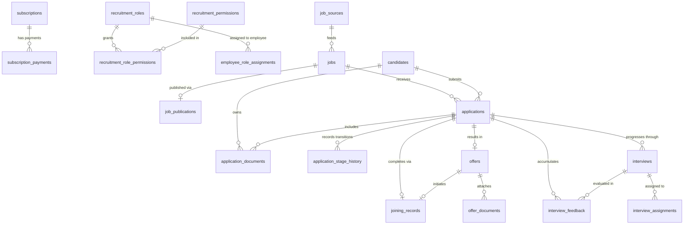

# NEXNUV Recruitment — Entity Relationship Diagram

```mermaid
erDiagram
    subscriptions ||--o{ subscription_payments : "has payments"
    recruitment_roles ||--o{ recruitment_role_permissions : "grants"
    recruitment_permissions ||--o{ recruitment_role_permissions : "included in"
    recruitment_roles ||--o{ employee_role_assignments : "assigned to employee"

    job_sources ||--o{ jobs : "feeds"
    jobs ||--o| job_publications : "published via"
    jobs ||--o{ applications : "receives"

    candidates ||--o{ applications : "submits"
    candidates ||--o{ application_documents : "owns"
    applications ||--o{ application_documents : "includes"
    applications ||--o{ application_stage_history : "records transitions"
    applications ||--o{ interviews : "progresses through"
    applications ||--o{ interview_feedback : "accumulates"
    applications ||--o| offers : "results in"
    applications ||--o| joining_records : "completes via"

    interviews ||--o{ interview_assignments : "assigned to"
    interviews ||--o{ interview_feedback : "evaluated in"

    offers ||--o{ offer_documents : "attaches"
    offers ||--o| joining_records : "initiates"
```

